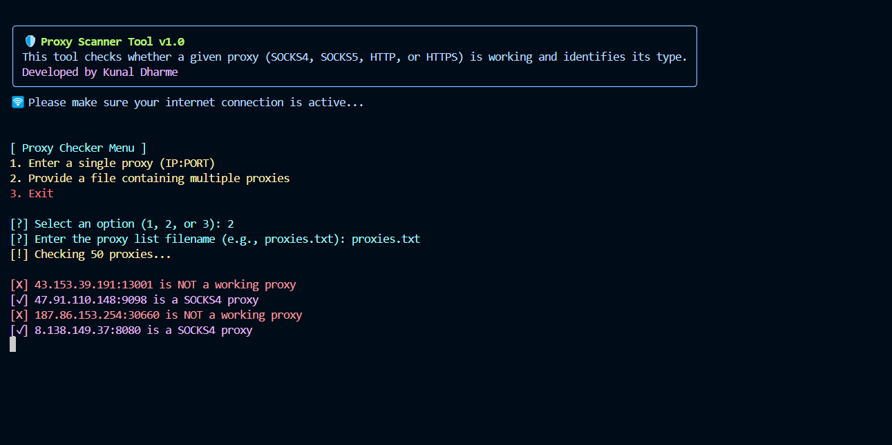

# 🛡️ Proxy Scanner Tool v1.0

## Overview
**Proxy-Check** is a Python tool that verifies whether a given proxy is working and identifies its type (SOCKS4, SOCKS5, HTTP, or HTTPS). It allows users to check a single proxy or scan a list of proxies from a file.



## Project Structure
```
Proxy-Check/
│── proxy_check.py          # Main script
│── requirements.txt        # Dependencies
│── README.md               # Project description
│── proxies.txt (50)        # Sample proxy list
```

## Features
- Detects **SOCKS4**, **SOCKS5**, **HTTP**, and **HTTPS** proxies.
- Supports checking individual proxies or bulk proxy lists.
- Provides a colorful terminal interface using `colorama`.
- Displays an ASCII banner using `pyfiglet`.

## Installation
1. Clone this repository or download the script:
   ```sh
   git clone https://github.com/yourusername/Proxy-Check.git
   cd Proxy-Check
2. Install dependencies:
   ```sh
   pip install -r requirements.txt
3. Run the Script:
   ```sh
   python3 proxy_check.py

## Author
Developed by Kunal Dharme.